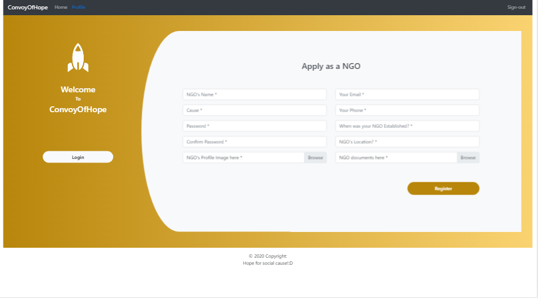

# convoyofhope

## Project setup
```
npm install
```
### Compiles and hot-reloads for development
```
npm run serve
```

# Introduction to Project	
The aim of the project is to build a common platform for various NGOs to posts their requests regarding required donations. And those requests will be visible to all the visitors of our website also they’ll get an option to make online payment through a payment gateway to fulfil the amount asked by the NGOs, also all the important information about an ngo will be visible to the user.
Details of modules and their functionality
The project has 3 modules:
Users 
Users do not need to login, they have direct access to the Home page of the website 
They have access to functionalities like the user can donate to a particular request or 
To a particular NGO. They can also view NGO profiles.

## NGO
NGO need to register with a valid certificate to prove their identity and only when 
Admin accepts the request he can make use of the functionality of the website.
NGO can update their profile details as in when required. NGOs also can 
Make requests, stating the amount required and they also need to state why they 
need this amount.

## Admin 
Admin can log in using his credentials and has the right to accept and deny the NGO 
request. He can view NGO profile, and also delete any profile on the website

# Development technologies
•	Frontend: Bootstrap, Bootstrap-vue, Vuejs
•	Database: Firebase

# Implementation
 Screenshots of each page with detail of working


# NGO module:

## Login:

This module accepts NGO or Admin’s email, address and authenticates if the credentials entered are correct or not. This page also consists a ‘Forgot password’ button, which will send a password resent link to the user 

## Registration Page:

All validations are set here, the NGO is requested to enter a profile image here and also their certificate so that admin can validate that particular NGO.

## NGO profile page:

This is the profile page of the NGO, this page is created only when the admin accepts NGO’s registration request. Through this page NGOs can make requests for any donation they need, and this will be visible on their profile as well as on the home page of our websites.

## NGO Edit

Through this module, ngos can update their profile information and they can also update their passwords. All the changes made will reflect on the ngo’s profile page.

# Admin Pages
## Admin DashBoard

Here through this dashboard admin can view ngo’s profiles, can delete an ngo from this website and also can view ngos documents as and when required.

## Admin Request Board

All the new registrations by the ngo get added to this page and then it is upto the admin to check if he shall accept or reject that particular ngos request.

# User module
## Home

This is the home page of our website, this can be viewed by anyone without any authentication. The user can visit ngo’s profiles and can also check the requests made by different ngos (visible in the image below).


## Requests

Here all the requests made by different ngo’s is visible and also the name of donors is visible.

## Profile 

This page is visible to a normal user and also to the admin of this website.
This page consists of all the necessary information of a ngo.


## Donate

This is the donate page, which will be visible when a user clicks on donate button of a request card. User here can donate through their paypal account or through debit or credit card. 

